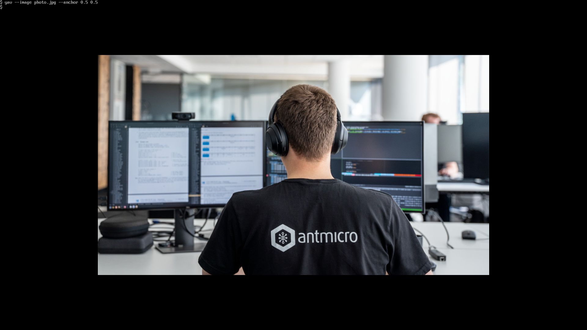

# Yet Another Viewer

Copyright (c) 2025-2026 [Antmicro](https://www.antmicro.com)

Show images on the Linux framebuffer or using DRM, with  precise control over their position on the screen.

## Build

To enable DRM support, install the `libdrm` development package first:

```bash
# Debian
apt install libdrm-dev
```

YAV uses CMake and can be built using the standard CMake workflow:

```bash
cmake -B build
cmake --build build
```

## Usage

YAV renders images directly to the framebuffer or a DRM device, so it cannot be used while a desktop environment is actively controlling the display. Run it from a text console (TTY). If a graphical desktop is running on the current virtual terminal, switch to another TTY before using it.

Example of displaying an image centered on the screen:

```bash
./build/yav --image photo.jpg --anchor 0.5 0.5
```



For a complete list of available options, run:

```bash
./build/yav --help
```

## License

This project is licensed under the Apache License, Version 2.0. See [LICENSE](LICENSE).
